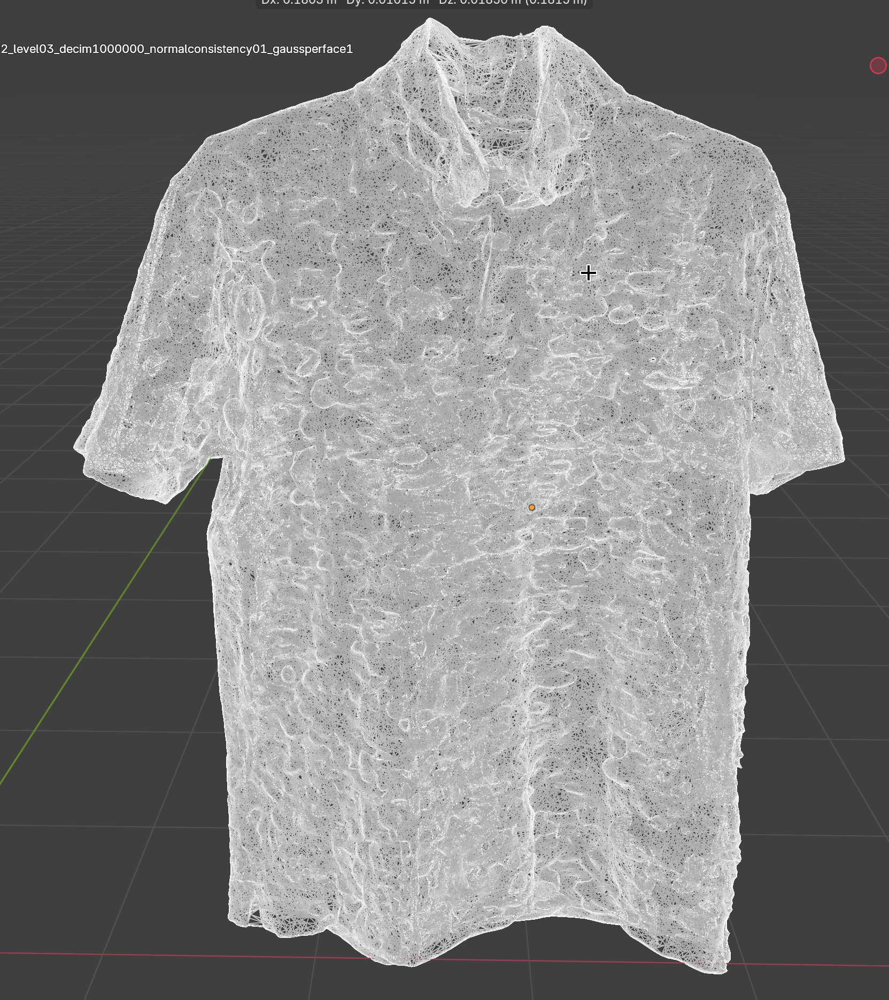
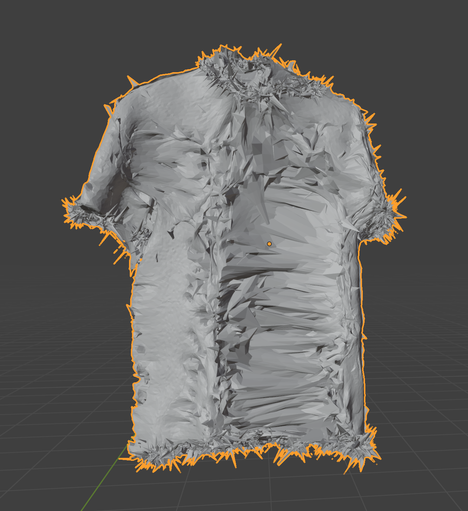
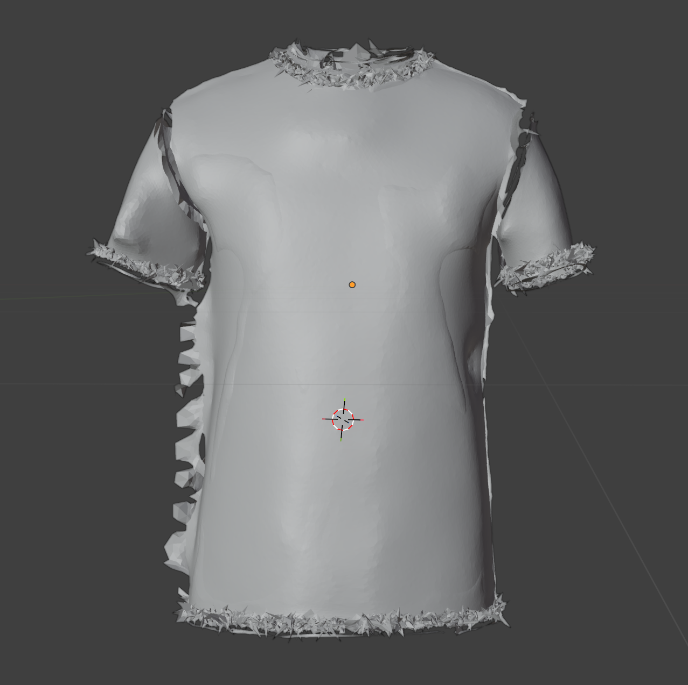
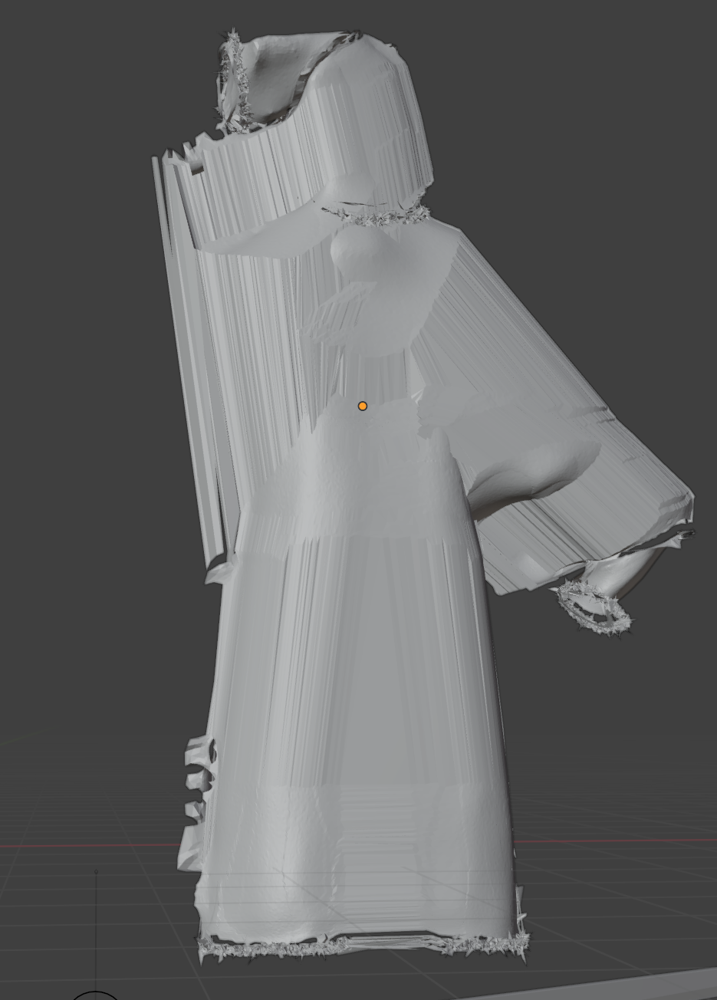
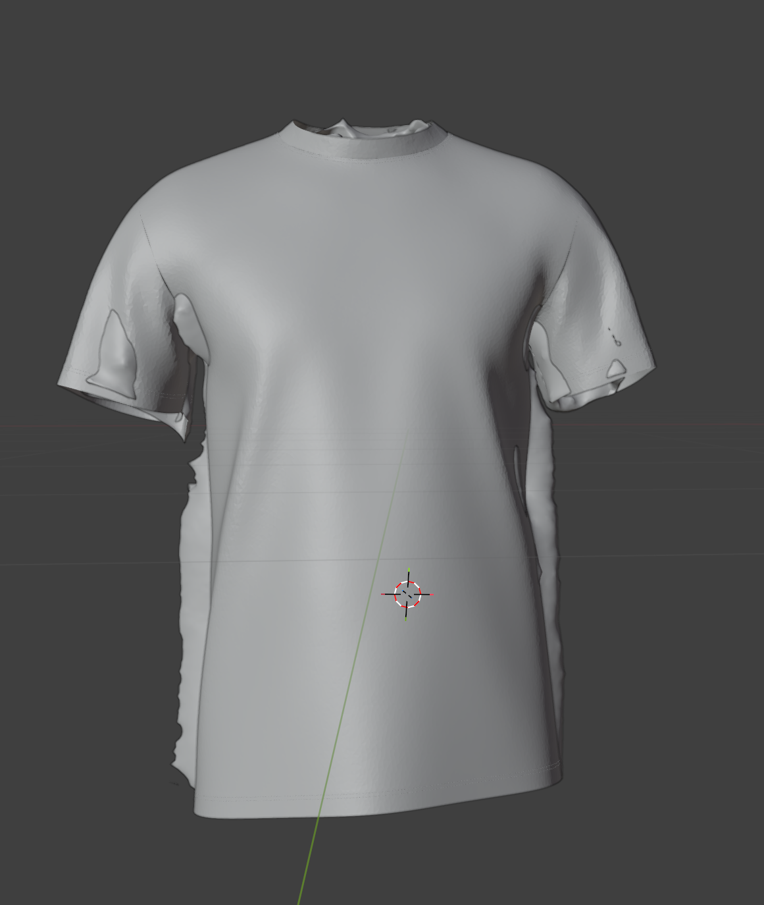
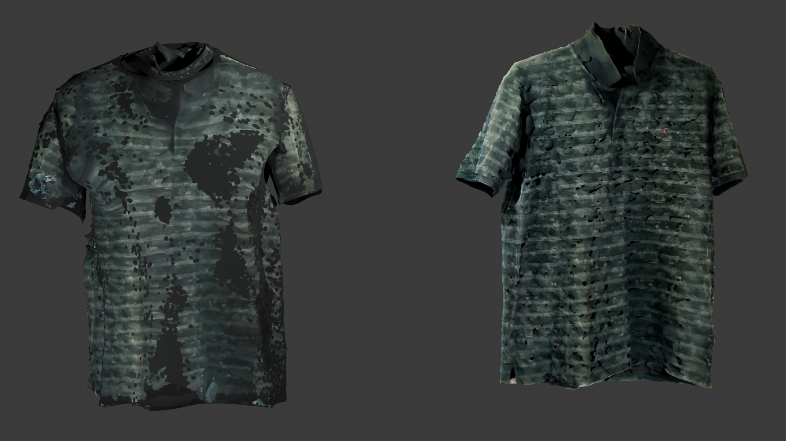
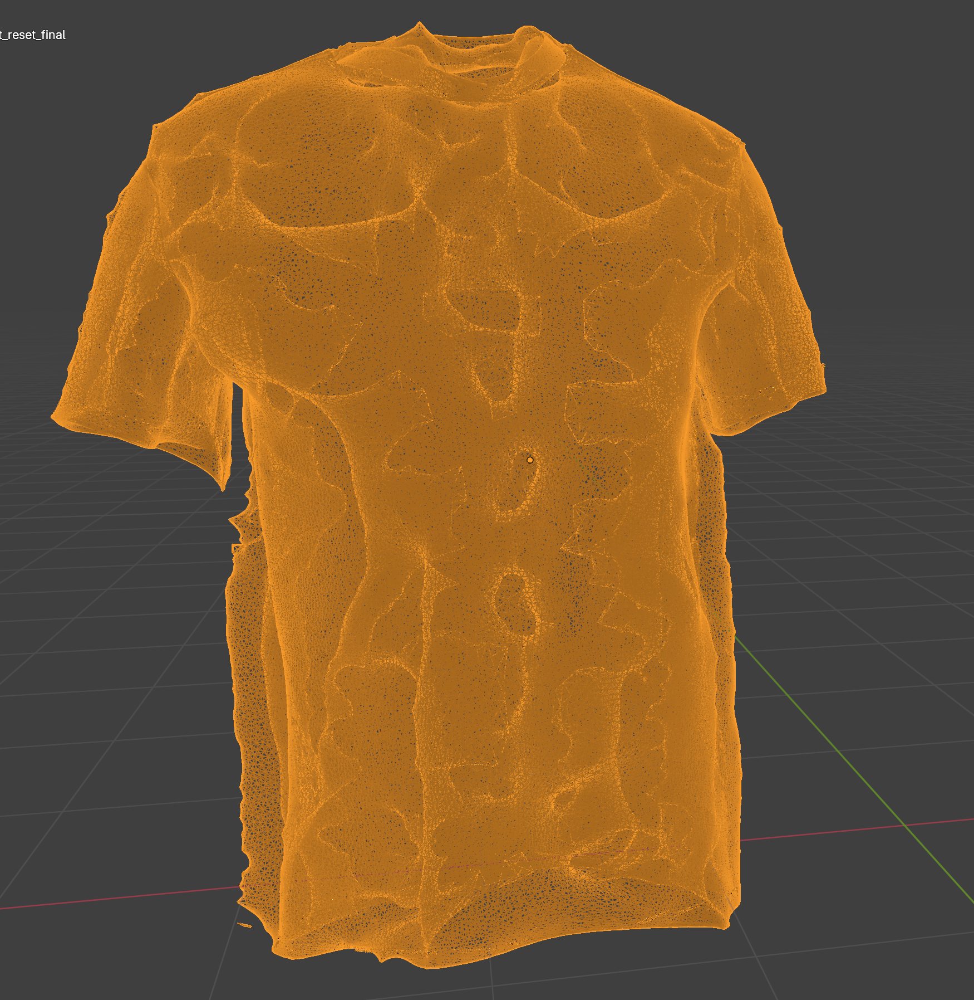

# Garment Digitization via Constrained Non Rigid Registration

This repository contains a PyTorch3D based pipeline for recovering clean, animatable garment topology from noisy 3D Gaussian Splatting (SuGaR) extractions. 

## 1. The Problem: The "Polygon Irregularities" Bottleneck
Extracting meshes directly from 3D Gaussian Splatting (via tools like SuGaR) yields excellent photometric results but highly degenerate geometry. The raw outputs are typically filled with internal faces, self intersections, and severe topological noise, making them impossible to use in standard downstream physics or animation engines.

**Raw SuGaR Extraction (Target):**

Attempting to use standard non-rigid registration (e.g., raw Chamfer Distance minimization) to fit a clean, SMPL aligned template to this noisy data consistently results in severe failure states. 

### Errors Encountered & Solved
During the development of this pipeline, several distinct optimization failures were encountered and systematically resolved:

1. **Volume Collapse (Shrinkage):** The optimizer collapses the mesh inward to minimize distance to internal noise artifacts.
   * *Solution:* Implemented a "Resting State" structural constraint (`mesh_edge_loss`), locking initial edge lengths to act as an anti collapse spring force.
   

2. **Topological Fringing (Spikes):** High frequency noise in the target scan causes the template to tear and spike at the boundaries (hems, sleeves).
   * *Solution:* Dynamic weight scheduling for Uniform Laplacian Smoothing to suppress high-frequency geometric spikes while preserving macro-structure.
   

3. **"Spiderweb" Stitching:** Vertices in high-proximity gaps (e.g., under the armpits) get pulled across empty space to attach to the torso.
   * *Solution:* Multi-phase optimization starting with rigid ICP alignment to guarantee proximity, followed by heavy stiffness constraints during the macro-deformation phase.
   

---

## 2. The Pipeline
This project bridges the gap between raw scan data and downstream simulation engines through a multi-stage registration process:

* **Rigid Docking (ICP):** Utilizes Iterative Closest Point to automatically correct global scale and orientation mismatches between the generic template and the scan before any non rigid deformation begins.
* **Volume-Preserving Optimization ("Soft-Shell" Warp):** By heavily penalizing deviations from the template's resting edge lengths, the optimization fits the mesh to the scan using Chamfer distance while mathematically forbidding the geometry from imploding into a 2D plane.
* **Automated LBS Rigging (Gravity Pose Constraint):** Standard T-pose nearest neighbor binding fails when a scanned garment has its sleeves draped down. The pipeline temporarily poses the underlying SMPL skeleton into a "Gravity Pose" (arms down) to accurately transfer skinning weights, and then lifts the newly rigged garment back into a T-pose.
* **Photometric Transfer:** High-frequency RGB data from the original noisy scan is baked onto the new canonical UV space via ray-casting.

---

## 3. Visual Results

**Clean Canonical Topology (Post-Optimization)**

**Photometric Transfer (The final baked asset)**

---

## 4. Future Work & Topology Improvements

While the current pipeline successfully prevents volume collapse and captures the macro folds of the garment, analyzing the final wireframe reveals areas for future refinement:

**Current Final Texture Wireframe:**

**Planned Improvements:**
1. **Quad Dominant Retopology:** The current template relies on dense triangulation. Implementing a differentiable remeshing step or transferring the warp to a quad-dominant mesh will significantly improve bending deformations during character animation.
2. **Adaptive Density:** The wireframe is uniformly dense. Future iterations will explore localized subdivision, maintaining high polygon counts in areas of high curvature (wrinkles/folds) while decimating flat regions (chest/back) for computational efficiency.
3. **Learned Skinning Weights:** Upgrading from Nearest Neighbor (k-NN) weight transfer to a graph neural network based weight diffusion to handle complex overlapping boundaries (like collars and cuffs) more smoothly during extreme joint articulation.

---
## Tech Stack
* Python, PyTorch, PyTorch3D, Trimesh, NumPy, Blender (Cycles Baking).
